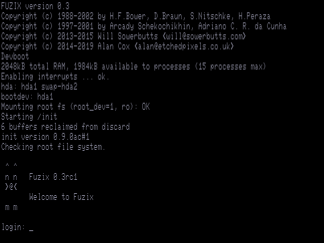
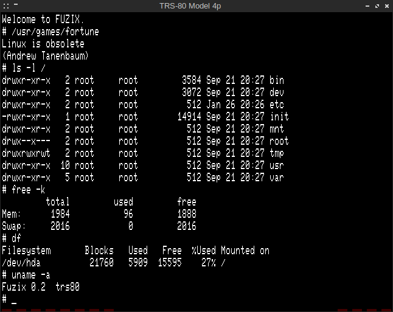

This is a modified version of Mark Grebe's [sdltrs] with patches by [EtchedPixels] for
running [FUZIX] and some bug fixes ...

[EtchedPixels]: https://www.github.com/EtchedPixels/xtrs
[FUZIX]: https://www.github.com/EtchedPixels/FUZIX
[sdltrs]: http://sdltrs.sourceforge.net/
