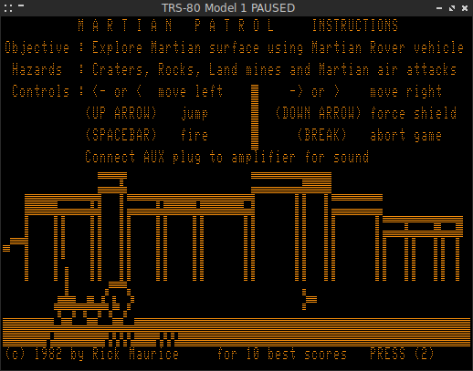
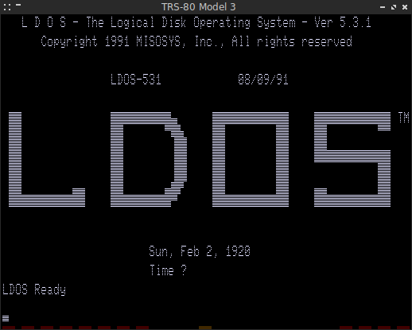
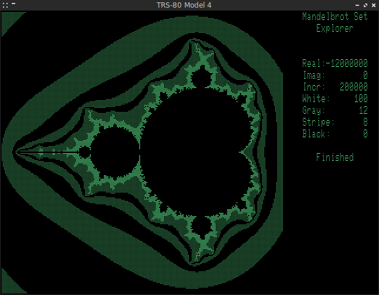
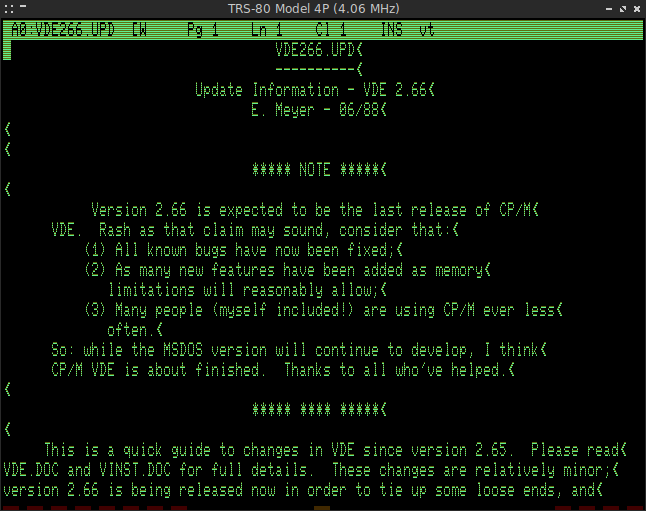

Modified version of Mark Grebe's [SDLTRS] with bug fixes and patches:

  * Included all patches by [EtchedPixels]: support for banked memory, Lowe LE18 ...
  * Fixed various SegFaults: ROM Selection Menu, Scaling in Fullscreen ...
  * Reworked the Interface: new shortcuts and key bindings, help screen ...
  * Ctrl-A, Ctrl-C & Ctrl-V can now be used in the Emulator (CP/M & WordStar) ...
  * Access to real floppy disks works now on Linux ...
  * Tried to fix reported bugs to the original version ...
  * Port to SDL2 (see [BUILDING.md] and [SDL2]) ...
  * Support for Exatron Stringy Floppy ...
  * Select and execute CMD files directly in the Emulator ...
  * Save screenshot of the Emulator window as BMP file ...
  * Show Z80 registers in the window title bar ...
  * Adjust speed of Z80 CPU on the fly ...
  * Emulate Z80 memory refresh register ...
  * Support for Sprinter II/III speed-up kits ...

## Binaries

  * [sdltrs.exe]     (32-bit, needs [SDL.DLL] of [SDL-1.2.14] for Win9X)
  * [sdl2trs.exe]    (32-bit, needs [SDL2.DLL])
  * [sdl2trs64.exe]  (64-bit, needs [SDL2.DLL])

(Build with MinGW & MinGW-w64)

## Packages

  * [sdltrs_1.2.11-1_i386.deb]    (32-bit, SDL)
  * [sdl2trs_1.2.11-1_i386.deb]   (32-bit, SDL2)
  * [sdltrs_1.2.11-1_amd64.deb]   (64-bit, SDL)
  * [sdl2trs_1.2.11-1_amd64.deb]  (64-bit, SDL2)

(Build on Debian 9/i386 & Linux Mint 19.3/amd64)

Thanks to Tércio Martins a package for Arch Linux is available in the [AUR].

## SDL2

The [SDL2] branch contains the SDL2 version with hardware rendering support.
Altough considered as *experimental*, it is recommended for 64-bit operating
systems (SDL2 binaries and packages above are build on the *master* branch).

The SDL2 version is available in Valerio Lupi's fork of the [RetroPie-Setup].

## Screenshots

[AUR]: https://aur.archlinux.org/packages/sdltrs
[BUILDING.md]: BUILDING.md
[EtchedPixels]: https://www.github.com/EtchedPixels/xtrs
[RetroPie-Setup]: https://github.com/valerino/RetroPie-Setup
[SDL2]: https://gitlab.com/jengun/sdltrs/-/tree/sdl2
[SDL.DLL]: https://www.libsdl.org/download-1.2.php
[SDL2.DLL]: https://www.libsdl.org/download-2.0.php
[SDL-1.2.14]: https://www.libsdl.org/release/SDL-1.2.14-win32.zip
[SDLTRS]: http://sdltrs.sourceforge.net
[sdltrs.exe]: bin/sdltrs.exe
[sdl2trs.exe]: bin/sdl2trs.exe
[sdl2trs64.exe]: bin/sdl2trs64.exe
[sdltrs_1.2.11-1_i386.deb]: bin/sdltrs_1.2.11-1_i386.deb
[sdl2trs_1.2.11-1_i386.deb]: bin/sdl2trs_1.2.11-1_i386.deb
[sdltrs_1.2.11-1_amd64.deb]: bin/sdltrs_1.2.11-1_amd64.deb
[sdl2trs_1.2.11-1_amd64.deb]: bin/sdl2trs_1.2.11-1_amd64.deb
